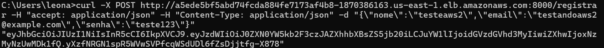
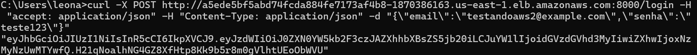
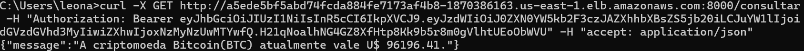

# Deploy na AWS com EKS

**Autor:** Leonardo Merlin Paloschi


## Requisitos

1. [**Amazon CLI**](https://docs.aws.amazon.com/cli/latest/userguide/getting-started-install.html)

2. [**EKSCTL**](https://eksctl.io/installation/)

3. [**kubectl**](https://kubernetes.io/docs/tasks/tools/)


## 1. Setup inicial

Para começar a mexer com a AWS, foi necessário entrar no Console IAM AWS para gerenciar as credenciais de acesso.

Após criadas as credenciais, configuramos localmente pelo cmd com o seguinte comando:
```bash
aws configure
```
Iremos especificar nosso AWS Access key ID, AWS Secret Access key, a região default e o formato de output de dados.

## 2. Criando Cluster

Usando o EKSCTL para criar nossos clusters, digitamos o seguinte comando:


Comando para criação do cluster:
```bash
eksctl create cluster --name projeto-cluster --region sa-east-1 --nodes 2 --node-type t3.medium
```

Depois de criar, temos que alterar o kubeconfig para se conectar devidamente aos nossos clusters.

```bash
aws eks --region sa-east-1 update-kubeconfig --name projeto-cluster
```

## 3. Arquivos para deploy

### API (`web-deployment.yaml`)
Neste arquivo configuramos toda a parte de deploy para a nossa API, como se fosse um compose para a AWS.
O seguinte arquivo foi criado:

```yaml
apiVersion: apps/v1
kind: Deployment
metadata:
  name: web-deployment
spec:
  replicas: 1
  selector:
    matchLabels:
      app: web
  template:
    metadata:
      labels:
        app: web
    spec:
      containers:
      - name: web
        image: leonardomp3/projeto_cloud:latest
        ports:
        - containerPort: 8000
        env:
          - name: USER
            value: "tester1"  
          - name: PASSWORD
            value: "senha1234" 
          - name: HOST
            value: "db" 
          - name: PORT
            value: "3306"  
          - name: DATABASE_NAME
            value: "Cloudb"  
          - name: SECRET_KEY
            value: "chavesecretademais" 
apiVersion: v1
kind: Service
metadata:
  name: web-service
spec:
  ports:
    - port: 8000
      targetPort: 8000
  selector:
    app: web
```

### Database (`db-deployment.yaml`)
Neste arquivo configuramos toda a parte de deploy para o nosso banco de dados. O seguinte arquivo foi criado:

```yaml
apiVersion: apps/v1
kind: Deployment
metadata:
  name: db-deployment
spec:
  replicas: 1
  selector:
    matchLabels:
      app: db
  template:
    metadata:
      labels:
        app: db
    spec:
      containers:
      - name: db
        image: mysql:8.0
        ports:
        - containerPort: 3306
        env:
          - name: MYSQL_ROOT_PASSWORD
            value: "senhadoroot"  
          - name: MYSQL_DATABASE
            value: "Cloudb" 
          - name: MYSQL_USER
            value: "tester1"
          - name: MYSQL_PASSWORD
            value: "senha1234" 
---
apiVersion: v1
kind: Service
metadata:
  name: db-service
spec:
  ports:
    - port: 3306
      targetPort: 3306
  selector:
    app: db
```

## 4. Finalmente deploy!

Faltou apenass realizar de fato o deploy, através dos seguintes comandos:

```bash
kubectl apply -f db-deployment.yaml
kubectl apply -f web-deployment.yaml
```
## Screenshot dos Endpoints Testados via CURL

#### 1. **POST /registrar**



#### 2. **POST /login**



#### 3. **GET /consultar**



**Vídeo de demonstração** [AWS deployment]()