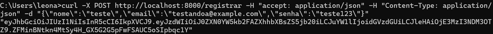

# API de Cotação da Bitcoin

**Autor**: [Leonardo Merlin Paloschi](https://github.com/leonardopaloschi)

### Pré-requisitos

- [Docker](https://www.docker.com/) instalado na máquina.
## Descrição do Projeto

O projeto se trata de uma API RESTFUL com 3 endpoints que, tem objetivo principal de cadastrar um usuario na base de dados, autenticar seu login e devolver para ele o valor atual da Bitcoin, utilizando o site [Coincap](https://docs.coincap.io) como origem desse dado.


### Funcionamento de cada ENDPOINT

- *REGISTRAR*: POST referente ao cadastro inicial do usuário. Dados de entrada são nome, e-mail e senha. É retornado um token JWT para o usuário.
- *LOGIN*: POST referente ao login do usuário. Dados de entrada são e-mail e senha. É retornado um token JWT para o usuário.
- *CONSULTAR*: GET referente à informação principal a ser requisitada na API, o valor da Bitcoin no momento do acesso. Apenas acessível a usuários autenticados.

## Executando localmente

### 1. Criação do `compose.yaml`

Para a execução local do projeto, será necessário a criação de um arquivo `compose.yaml` que será responsável por baixar a [imagem](https://hub.docker.com/r/leonardomp3/projeto_cloud) do DockerHub. Você pode copiar o arquivo a seguir e implementar no seu próprio `compose.yaml` ou também baixar no repositório do git, onde o arquivo segue o nome descrito.

```yaml
services:
  db:
    image: mysql:8.0  
    environment:
      MYSQL_ROOT_PASSWORD: ${DB_ROOT_PASS:-projeto} 
      MYSQL_DATABASE: ${DB_NAME:-projeto} 
      MYSQL_USER: ${DB_USER:-projeto}
      MYSQL_PASSWORD: ${DB_PASS:-projeto}
    ports: 
      - "3307:3306"
    env_file:
      - ./.env  

  web:
    image: leonardomp3/projeto_cloud:latest  
    ports: 
      - "8000:8000"  
    depends_on:
      - db
    environment:
      - USER=${DB_USER:-projeto}
      - PASSWORD=${DB_PASS:-projeto}
      - HOST=db
      - PORT=3306
      - DATABASE_NAME=${DB_NAME:-projeto}
      - SECRET_KEY=${SECRET_KEY:-projeto}
    env_file:
      - ./.env  
    restart: always
```

### 2. Configurar .env :
Para a criação das variáveis para o banco de dados e para a secret key, responsável pelo hash da senha, foi usado um .env no formato a seguir para definir cada uma delas. É só colocar o .env no mesmo diretorio do compose, que deerá seguir esse formato.

```bash
DB_USER="qualquer_user"
DB_PASS="qualquer_senha"
DB_NAME="qualquer_nome_base_de_dados"
DB_ROOT_PASS="qualquer_senha_root"
SECRET_KEY="top_secret_key"
```

### 3. Compose Up:

Após estar executando a engine do docker (podendo ser via Docker Desktop, por exemplo), abra um terminal no mesmo diretório do `compose.yaml` e rode o seguinte comando:

```bash
docker compose up 
```
Com isso, seu aplicativo já estará rodando localmente. Deixe o terminal que você deu o comando acima aberto enquanto quiser testar localmente, pois uma vez que fechar o serviço será interrompido. Para finalizar da maneira correta o serviço, use o comando:
```bash
docker compose down 
```
Porém, deixe esse passo para depois de testar!

### 4. Abrindo o site localmente:

Depois de ter rodado o `docker compose up`, abra o navegador de sua preferencia e acesse `http://localhost:8000` para visualizar a aplicação. A página interativa da API estará hospedada em [`http://localhost:8000/docs`](http://localhost:8000/docs), porém o endpoint *CONSULTAR* não funciona via essa interface, apenas via CURL, como será mostrado adiante.

## Endpoints

### 1. **POST /registrar**

   POST referente ao cadastro inicial do usuário. Dados de entrada são nome, e-mail e senha. É retornado um token JWT para o usuário.

   - **Request**:
      ```json
     {
         "nome": "seunome",
         "email": "seuemail@example.com",
         "senha": "suasenha"
     }
      ```

   - **CURL**:
      ```bash
        curl -X POST http://localhost:8000/registrar -H "accept: application/json" -H "Content-Type: application/json" -d "{\"nome\":\"seunome\",\"email\":\"seuemail@example.com\",\"senha\":\"suasenha\"}"
      ```

   - **Response**: 
     ```json
     "token_jwt_gerado"
     ```

### 2. **POST /login**

   POST referente ao login do usuário. Dados de entrada são e-mail e senha. É retornado um token JWT para o usuário.

   - **Request**:
      ```json
     {
        "email": "seuemail@example.com",
        "senha": "suasenha"
     }
      ```
   - **CURL**:
      ```bash
        curl -X POST http://localhost:8000/login -H "accept: application/json" -H "Content-Type: application/json" -d "{\"email\":\"testando@example.com\",\"senha\":\"teste123\"}"
      ```

   - **Response**: JSON
     ```json
     "token_jwt_gerado"
     ```

### 3. **GET /consultar**

   GET referente à informação principal a ser requisitada na API, o valor da Bitcoin no momento do acesso. Apenas acessível a usuários autenticados.

   - **Header**:
     ```
     Authorization: Bearer <JWT>
     ```
   - **CURL**:
      ```bash
        curl -X GET http://localhost:8000/consultar -H "Authorization: Bearer <seu_token_jwt>" -H "accept: application/json"
      ```
   - **Response**: JSON
     ```json
     {"message":"A criptomoeda Bitcoin(BTC) atualmente vale U$ 96422.57."}
     ```


## Screenshot dos Endpoints Testados via CURL

#### 1. **POST /registrar**



#### 2. **POST /login**


#### 3. **GET /consultar**


### Vídeo de Demonstra;áo

Link para o vídeo de demonstração: [Vídeo de Demonstração](https://youtu.be/-5WwMlfrgl4)

## [Link do Docker Hub](https://hub.docker.com/r/leonardomp3/projeto_cloud)
